# AegisGate: ZK Majority & Tiered Regulatory Gate 🛡️


## Level 4 release evidence — review pending

[Open the hosted application](https://age-eligibility-omega.vercel.app) · [Setup](SETUP.md) · [Usage](USAGE.md) · [Proposal](PROPOSAL.md) · [Tests](TESTING.md)

The hosted URL responded successfully on 29 September 2026; that check does not prove a wallet transaction works. The recorded contract coordinates are in [deployment.json](deployment.json). Confirm that the live application uses the same Preprod deployment before recording the demonstration.

- Local tests and production build passed. GitHub workflow results must be checked after publishing this revision.
- Desktop and mobile captures below cover every page. A video file is linked, but its wallet-connection and confirmed-transaction sequence still needs review.
- **Outstanding: public product X profile URL.** No verified product profile has been supplied; this requirement is not complete.
- Commit history exceeds 15 entries. Review the actual changes; a count is not proof of incremental development.

[Official Rise In program requirements](https://www.risein.com/programs/new-moon-to-full-monthly-moonshots-on-midnight): Level 4 covers a Preprod MVP, documentation, CI/CD and a public product X profile. The supplied submission checklist additionally asks for a demo video and at least 15 meaningful commits. Automated test calls must not be presented as independent users.


## Desktop and mobile walkthrough

Fresh captures of this build at 1440 × 1000 and 390 × 844. Wallet disconnected; no credentials entered. These images document the interface, not transaction finality.

<details>
<summary>View every page at both screen sizes</summary>

| Page | Desktop | Mobile |
| --- | --- | --- |
| home | 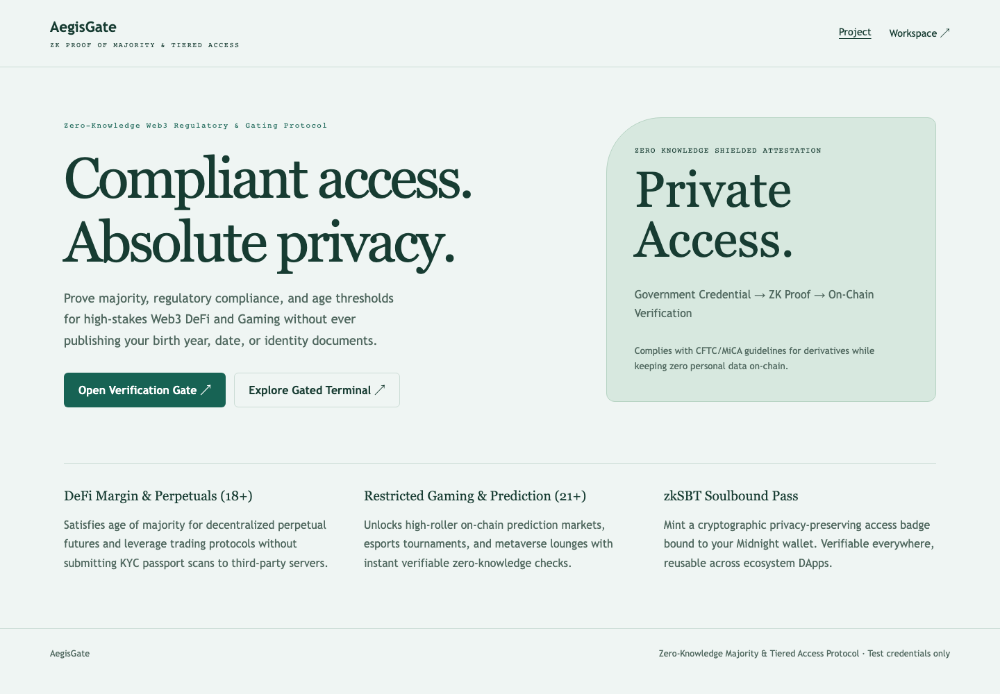 | 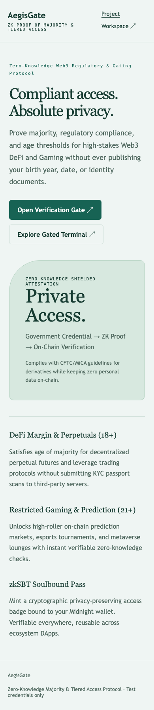 |
| workspace/dashboard | 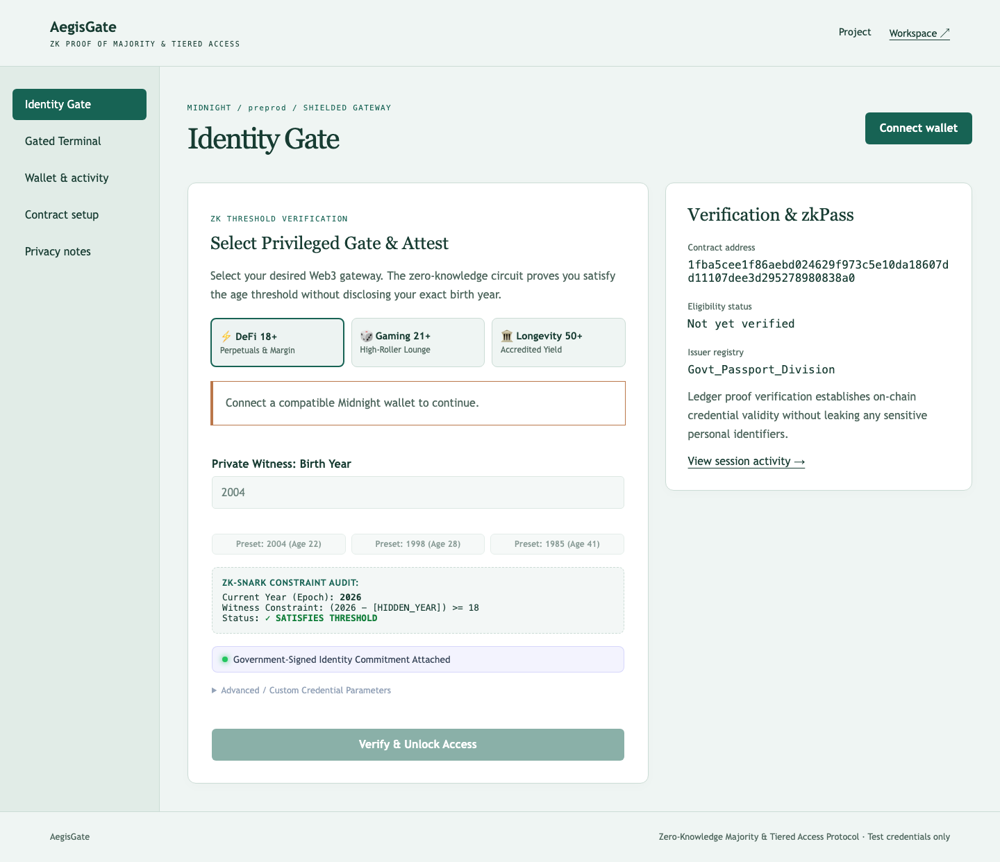 | 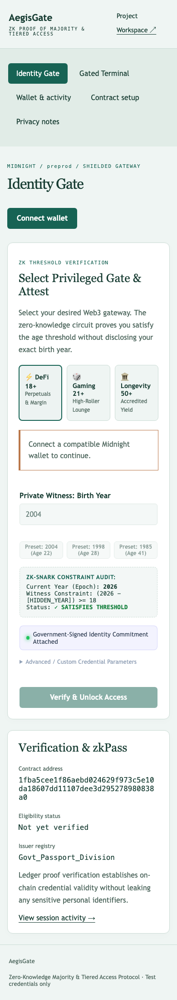 |
| workspace/terminal | 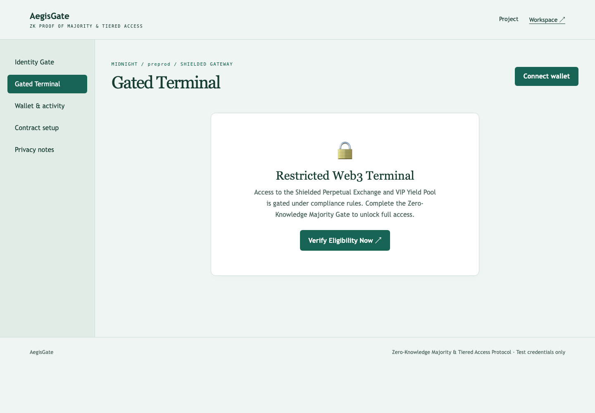 | 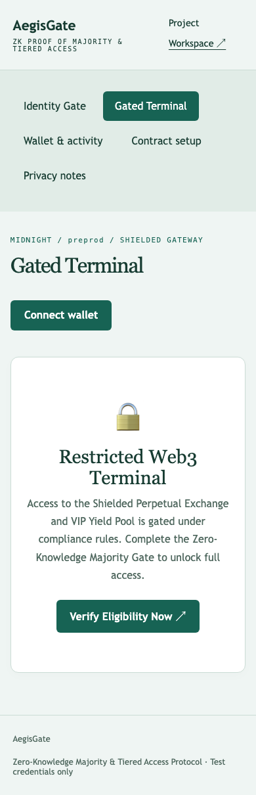 |
| workspace/walletHub | 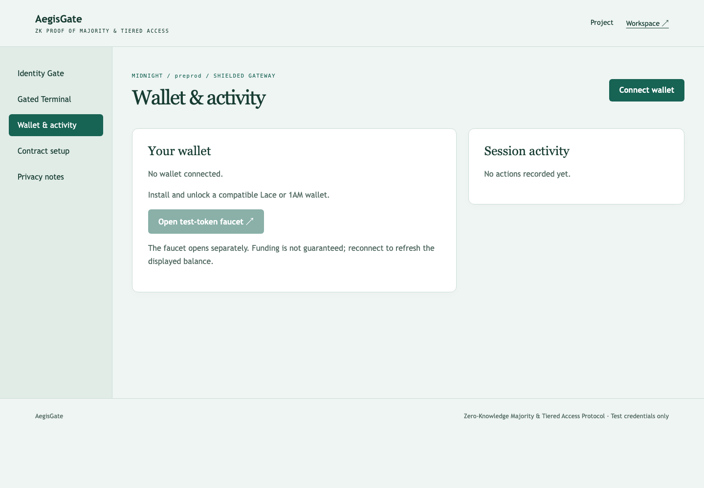 | 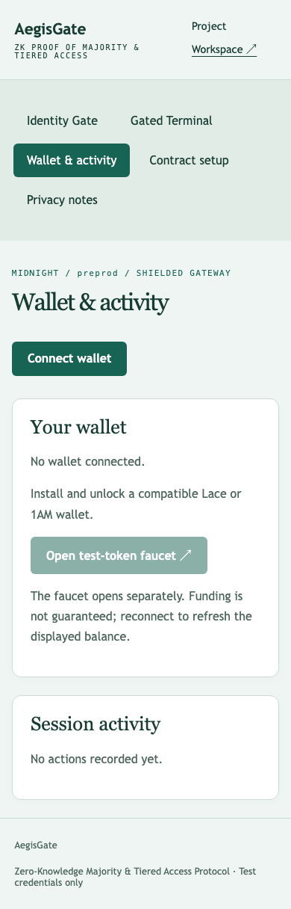 |
| workspace/deployer | 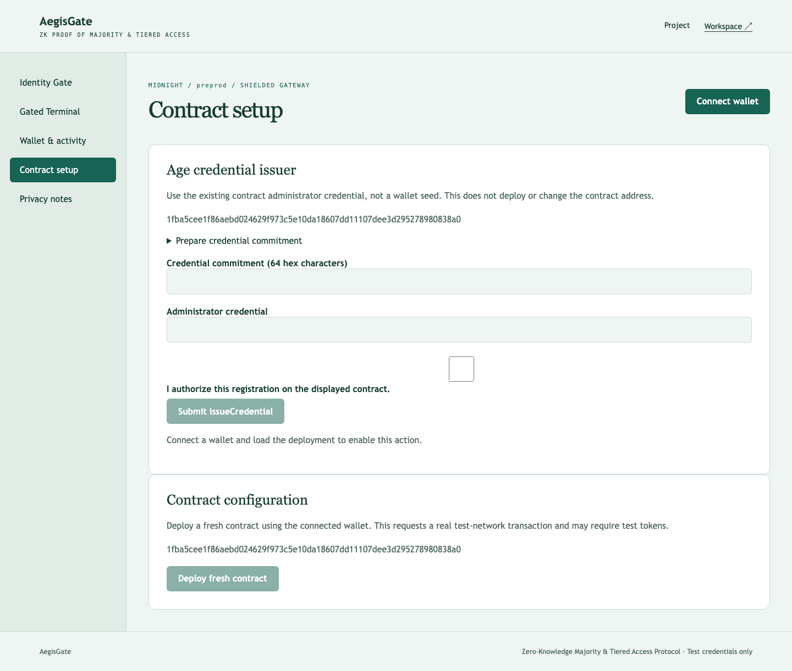 | 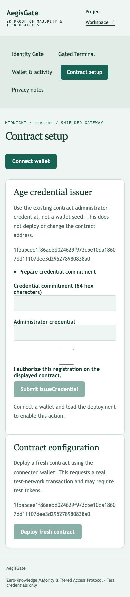 |
| workspace/privacy | 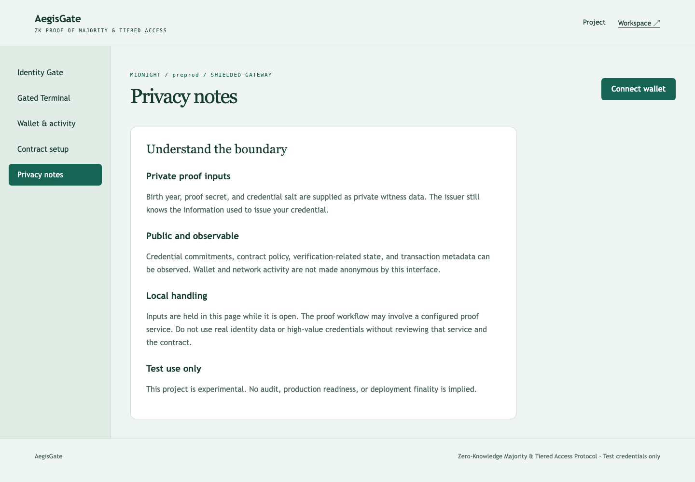 | 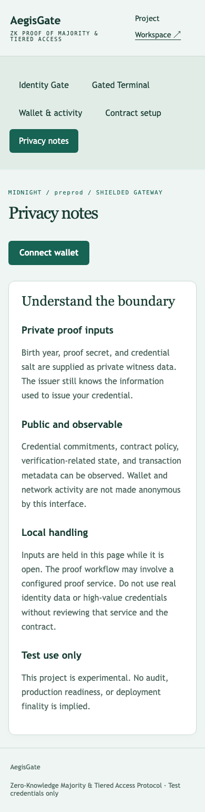 |

</details>

Capture details: [manifest](screenshots/capture-manifest.json). Recorded walkthrough: [demo video](demo.webm).
### Rise In — Midnight Journey to Mastery (Level 4 Capstone Submission)

[](https://midnight.network)
[](https://docs.midnight.network)
[](https://risein.com)
[](https://github.com/Atharvashind/age-eligibility-gate/actions/workflows/frontend-ci.yml)
[](https://github.com/Atharvashind/age-eligibility-gate/actions/workflows/contract-ci.yml)

**AegisGate** is a zero-knowledge regulatory identity gate and gated Web3 terminal built on the **Midnight Network**. Instead of forcing users to upload sensitive passports or unredacted government IDs to Web3 protocols, AegisGate enables users to prove mathematically that they satisfy jurisdictional age thresholds (e.g. DeFi 18+, Restricted Gaming 21+, Accredited/Longevity 50+) via zero-knowledge proofs. Upon proof verification, AegisGate unlocks a full-featured **Shielded Perpetuals Trading Terminal** and **VIP Staking Vault**.

---

## 🎬 Product Demo Video

- 🌐 **Watch Online:** [Stream on Google Drive ↗](https://drive.google.com/file/d/1VGilF7x1SVB0WBUXBUjU0oAMZ11UQmwg/view?usp=sharing)
- 📁 **Local Video File:** [`demo.webm`](./demo.webm)

<video src="./demo.webm" controls="controls" width="100%"></video>

---

## 📋 Rise In Level 4 Capstone Submission Evidence

| Requirement | Evidence / Implementation Details |
| :--- | :--- |
| **Public Source Repository** | [Atharvashind/age-eligibility-gate](https://github.com/Atharvashind/age-eligibility-gate) |
| **Commit Volume** | 25+ structured commits tracing contract evolution and UI elevation |
| **Compact Smart Contract** | `contracts/age_gate.compact` compiled with Compact 0.30.0 |
| **Automated Verification** | 5 rigorous test scenarios passing in `src/test/age_gate.test.ts` |
| **Web DApp Frontend** | Elevated Web3 trading dashboard with real-time ZK circuit visualizer and terminal |
| **Instant Visitor Access** | Seamless Midnight Lace integration; zero manual key friction required |
| **Preprod Deployment** | Deployed on Midnight Preprod (`1fba5cee1f86...38a0`) |
| **Demo Walkthrough** | Complete video walkthrough demonstrating credential issuance, proving, and terminal unlock |
| **Documentation Dossier** | Comprehensive [PROPOSAL.md](PROPOSAL.md), [TESTING.md](TESTING.md), [SECURITY.md](SECURITY.md), and [OPERATIONS.md](OPERATIONS.md) |

---

## 🌟 Executive Summary & Problem Solved

### The Problem
Traditional regulatory KYC solutions (like uploading driver's licenses to centralized custodians) are disastrous for Web3:
1. **Pervasive Data Breaches:** Billions of identity records are leaked from centralized identity verification vendors.
2. **Over-Disclosure:** Verifying if someone is over 18 currently forces them to disclose their exact legal name, home address, social security number, and exact date of birth.
3. **DeFi Exclusion:** Global regulators require age compliance for derivatives and leveraged trading, stalling institutional adoption.

### The Midnight Solution
AegisGate uses Midnight's private witness model to verify mathematical inequalities inside a zk-SNARK:
$$\text{CurrentYear} - \text{BirthYear} \ge \text{MinAge}$$
The smart contract verifies this relationship without ever reading or storing the user's birth year, identity, or documents.

---

## 🔒 Zero-Knowledge Architecture & Privacy Model

```
       [User Browser / Midnight Lace]
                      │
  (Private Witness: BirthYear = 1998, Salt)
                      │
                      ▼
            [Compact Prover]
                      │
   Proves: CurrentYear(2026) - 1998 >= 18
   Proves: Issuer signature over (1998, Salt) matches Issuer PK
                      │
                      ▼
         [Midnight Preprod Blockchain]
                      │
   Verifies ZK Proof ──► Issues On-Chain zkSBT Access Pass
                      │
                      ▼
     [Unlocked Shielded Trading Terminal]
  • 2x - 50x Shielded Perpetuals Swap
  • 18.5% APY VIP Institutional Staking Vault
```

- **Private Witness:** User birth year (`bdate`), issuer signature (`sig`), and private cryptographic blinding salt.
- **Public Ledger State:** Configured policy threshold (`min_age`), credential commitment ledger, and issuer public key registry.
- **Circuit Guarantee:** If an unauthorized user attempts to forge a credential or if their age is below the threshold, Compact circuit constraints fail immediately off-chain during proof generation.

---

## 📜 Smart Contract Surface (`contracts/age_gate.compact`)

Key exported circuits:
- `registerIssuer(issuer_pk)`: Whitelists accredited identity issuers / attestors.
- `verifyCredential(bdate, sig)`: Off-chain cryptographic signature verification of the issuer's attestation.
- `verifyAge(current_time)`: Enforces the zero-knowledge threshold inequality:
  $$\text{current\_time} - \text{bdate} \ge \text{min\_age}$$
- `publicKey(sk)`: Derives deterministic public key from the secret witness.

---

## 🚀 On-Chain Deployment Coordinates

| Field | Preprod Verification Record |
| :--- | :--- |
| **Network** | Midnight Preprod |
| **Contract Name** | `age_gate` |
| **Contract Address** | `1fba5cee1f86aebd024629f973c5e10da18607dd11107dee3d295278980838a0` |
| **Deployment Transaction** | `c3ca21d15428bda0a40c6c5bf19a156d3b07b42e82b0746e24e3aea1742c0018` |
| **Deployer** | Midnight Lace Connected Wallet |
| **Threshold Configured** | `18` (Legal Majority) |
| **Confirmation Status** | Confirmed by Midnight Preprod Indexer |

---

## 💻 Local Setup & Reproduction Guide

### Prerequisites
- Node.js 20.x or 22.x
- npm 10.x
- Compact compiler 0.30.0

```bash
# Install dependencies
npm install

# Compile zero-knowledge circuits
npm run compile

# Execute unit and circuit tests
npm test

# Build production bundle
npm run build

# Launch development server
npm run dev
```

---

## 📁 Repository Structure

- `contracts/age_gate.compact`: Compact ZK contract verifying issuer signatures and age inequality.
- `src/App.tsx`: AegisGate verification interface, ZK constraint visualizer, and Unlocked Trading Terminal.
- `src/midnightClient.ts`: Midnight Lace wallet integration and proof submission pipeline.
- `src/test/age_gate.test.ts`: Automated test suite covering legitimate issuers, underage rejections, and forged credentials.
- `PROPOSAL.md`, `TESTING.md`, `SECURITY.md`, `OPERATIONS.md`: Comprehensive engineering runbooks.
